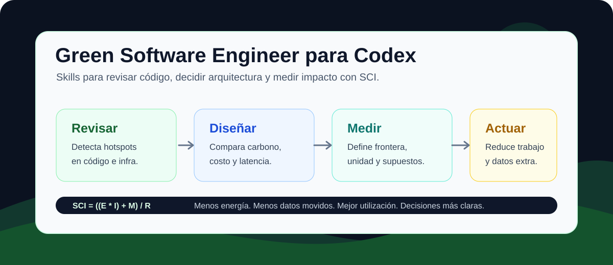

# Green Software Engineer for Codex



> Skills de Codex para revisar, diseñar y optimizar software con criterios de sostenibilidad, eficiencia energética y carbono.

[](#-skills-incluidas)
[](#-qué-cubre)
[](#-medición-sci)
[](#-uso-rápido)

Este repositorio contiene un paquete de skills para que Codex pueda trabajar con criterios de ingeniería de software verde: menos cómputo innecesario, menos datos movidos, mejor utilización de infraestructura, medición más clara y decisiones técnicas con tradeoffs explícitos.

La idea no es decorar el desarrollo con sostenibilidad. La idea es incorporarla como una preocupación práctica de ingeniería junto con rendimiento, costo, confiabilidad y experiencia de usuario.

## 🚀 Skills incluidas

| Skill | Rol | Úsala para |
| --- | --- | --- |
| `$green-software-engineer` | Asesor técnico | Arquitectura baja en carbono, SCI, IA/ML, cloud, APIs, bases de datos, pipelines, caché, autoscaling y decisiones de diseño. |
| `$green-review` | Revisor estructurado | Detectar hotspots de carbono en código, infraestructura, consultas, jobs, pipelines, caché y flujos de IA/ML. |

## ✨ Por qué usarlo

| Necesidad | Cómo ayuda Codex |
| --- | --- |
| Revisar una API caliente | Busca payloads grandes, round trips evitables, falta de caché, paginación o límites. |
| Auditar cloud/infra | Detecta sobreaprovisionamiento, servicios siempre encendidos, falta de autoscaling o scale-to-zero. |
| Evaluar IA/ML | Revisa fanout de modelos, límites de tokens, caché de embeddings, loops agénticos y uso de aceleradores. |
| Crear una línea base SCI | Ayuda a definir frontera, unidad funcional, energía, intensidad de carbono y supuestos. |
| Preparar una decisión de arquitectura | Compara opciones por carbono, costo, latencia, confiabilidad y complejidad. |

## ⚡ Uso rápido

Invoca la skill por nombre dentro de Codex:

```text
Usa $green-software-engineer para comparar polling y webhooks desde una perspectiva de software verde.
```

```text
Usa $green-review para auditar este servicio Terraform por sobreaprovisionamiento.
```

También puedes pedir una revisión directa:

```text
Revisa este endpoint con criterios de sostenibilidad y dime los hotspots de carbono.
```

## 📦 Instalación

Instalación local dentro de un proyecto:

```text
mi-proyecto/
`-- .codex/
    `-- skills/
        |-- green-software-engineer/
        |   |-- SKILL.md
        |   |-- agents/openai.yaml
        |   `-- references/
        |       |-- ai-ml-carbon.md
        |       |-- domain-guides.md
        |       `-- sci-baseline.md
        `-- green-review/
            |-- SKILL.md
            |-- agents/openai.yaml
            `-- references/
                |-- review-domains.md
                `-- review-severity.md
```

Instalación global:

```text
~/.codex/skills/
|-- green-software-engineer/
`-- green-review/
```

## 🧭 Cuándo aporta más valor

| Dominio | Hotspots típicos |
| --- | --- |
| Backend y APIs | Rutas calientes, polling, payloads sobredimensionados, trabajo síncrono pesado. |
| Bases de datos | N+1, scans grandes, índices faltantes, lecturas sin límite, retención excesiva. |
| Cloud e infraestructura | Capacidad inactiva, regiones, autoscaling, jobs batch, servicios siempre encendidos. |
| Pipelines de datos | Reprocesamiento, particionado, compresión, frecuencia de jobs, procesamiento incremental. |
| Web y media | Bundles grandes, imágenes/video pesados, exceso de JavaScript, caché/CDN ausente. |
| IA/ML | LLMs grandes sin necesidad, prompts largos, embeddings repetidos, fanout de herramientas, GPUs/TPUs infrautilizadas. |

## 🧮 Medición SCI

Cuando la medición sea relevante, las skills usan como referencia:

```text
SCI = ((E * I) + M) / R
```

| Variable | Significado |
| --- | --- |
| `E` | Energía consumida por el software. |
| `I` | Intensidad de carbono de la electricidad. |
| `M` | Emisiones incorporadas asignadas al software. |
| `R` | Unidad funcional: solicitud, usuario, transacción, workflow, token, imagen, etc. |

## 🌱 Qué cubre

- Principios de Green Software Foundation.
- Software Carbon Intensity y selección de unidades funcionales.
- SCI de consumidor y proveedor para sistemas de IA.
- Revisiones por dominio: backend, APIs, bases de datos, cloud, pipelines, web/media e IA/ML.
- Caché, batching, scale-to-zero, demand shaping y planificación sensible al carbono.
- Priorización de hallazgos por impacto probable, no por etiquetas "verdes".

## 🧩 Estructura del repositorio

```text
.
|-- README.md
|-- docs/
|   |-- codex-guide.md
|   `-- assets/
|       `-- green-software-codex-map.svg
`-- .codex/
    `-- skills/
        |-- green-software-engineer/
        `-- green-review/
```

## 🛡️ Principio de trabajo

El paquete evita asumir que una solución es más verde solo por su categoría. Serverless, edge, servicios administrados, regiones cloud específicas o modelos más pequeños pueden ser buenas opciones, pero dependen de volumen, utilización, latencia, retención de datos, intensidad de carbono y frontera de medición.

Para más detalle, consulta la [guía de Codex](docs/codex-guide.md).
